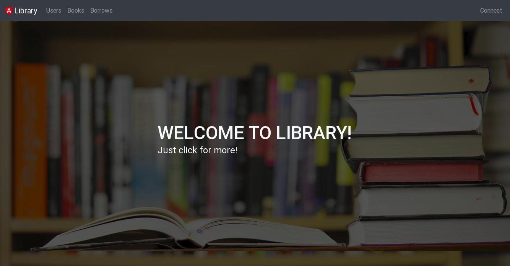
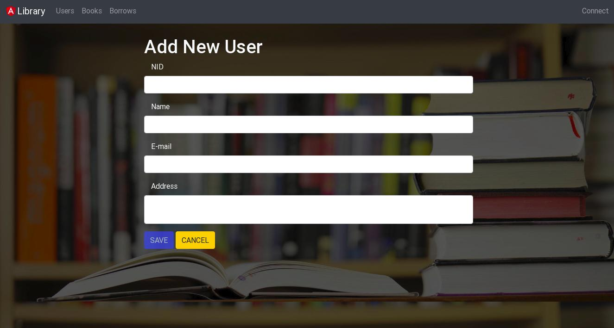
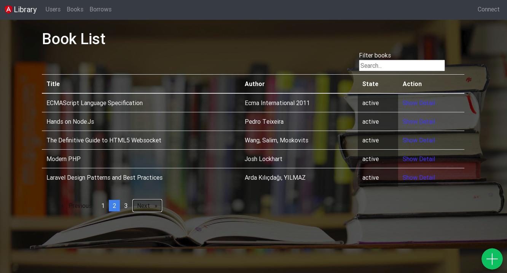
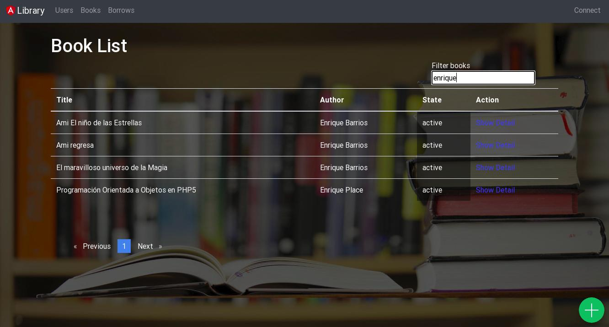

# Mean Library
> Es una aplicacion desarrollada en Node y Express; que usa una base de datos en
Mongodb (API Rest) y es consumida con Angular 5.
> Consta de un sistema que simula el comportamiento de una biblioteca, donde se
cumpla con los siguientes requerimientos funciones y de calidad:
- Gestión de usuarios: Se almacena el nombre, su dni, su dirección y correo.
- Gestión de libros: Se debe almacenar la información del libro como son,
identificador, titulo, idioma, nombre editorial y estado. También se debe permitir la modificación del libro y cambiar de estado al mismo.
- Gestión de préstamos: El sistema debe tener la opción de realizar préstamos, y
se debe guardar la información del libro prestado y el nombre del usuario junto
con la fecha y días a prestar.

This project was generated with [Angular CLI](https://github.com/angular/angular-cli) version 6.1.5.

## Screenshots / Capturas de Pantalla





## Tech-framework used / Tecnologías Usadas
- Angular 5.2.0
  - Angular CLI 6.1.5
- Node 8.11.3
  - express 4.16.3
  - mongoose 5.1.7
  - nodemon 1.17.3
- Mongodb 3.2.11
- Bootstrap 4.1.0
- ngx-bootstrap 3.0.0
- ngx-pagination 3.1.1
- Alertifyjs 1.11.1

## Install / Instalación
#### OS X, Linux y Windows
*Abra un terminal y ejecute:*
```Shell
git clone http://github.com/pulidovpe/mean-library.git

cd mean-library

npm install

npm start
```
## Tasks / Lista de Tareas
- [x] Inicializar repositorio
- [x] Subir mis primeros cambios a GitHub
- [x] Completar el back-end
- [x] Probar el API
- [x] Pruebas en el front-end con Angular 5
- [x] Se hizo deploy en heroku.
- [ ] Completar el front-end

> Se puede ver la app (actualmente en desarrollo) desplegada en [heroku](https://mean-library.herokuapp.com/)

## Contribute / Para contribuir
1. Has un [Fork](https://github.com/pulidovpe/mean-library/fork)
2. Crea tu propia rama (git checkout -b feature/fooBar)
3. Sube tus cambios (git commit -am 'Add some fooBar')
4. Actualiza tu rama (git push origin feature/fooBar)
5. Has un "Pull Request"

## Credits / Créditos
En este proyecto, me he guiado del tutorial publicado en esta página:
[Didin J](https://www.djamware.com/post/5a0673c880aca7739224ee21/mean-stack-angular-5-crud-web-application-example), propiedad del usuario @github/didinj

## License / Licencia
Pulido V.P.E. – @github/pulidovpe – pulidovpe.dev@gmail.com
Distributed under the MIT license. See [LICENSE](LICENSE) for more information.
